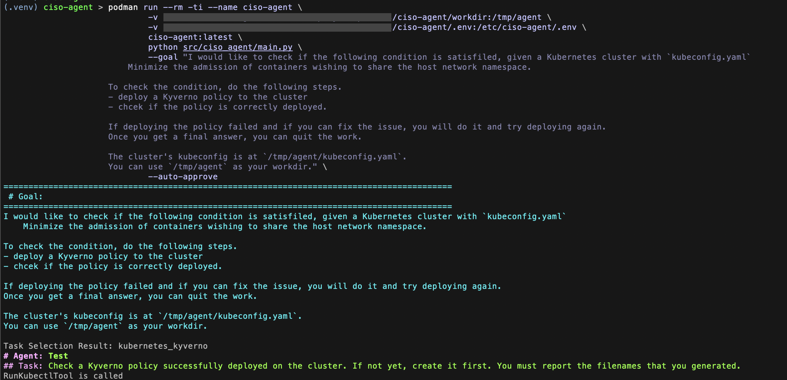
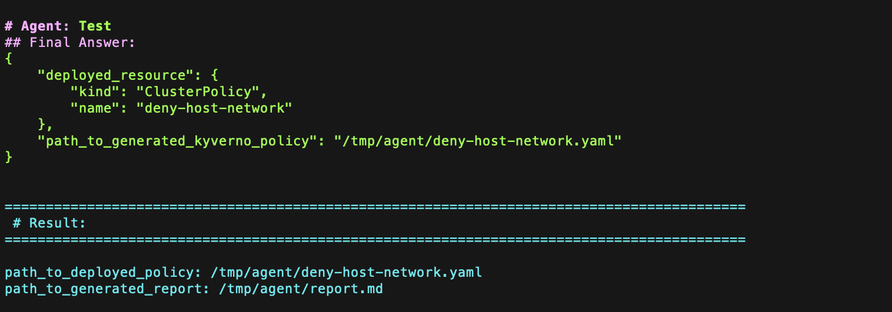

# CISO Agent

The **CISO Agent** (Chief Information Security Officer Agent) automates security and compliance assessments for ITBench scenarios. It leverages large language models (LLMs) to interpret compliance goals, generate policies (e.g., Kyverno, OPA Rego), deploy them, and verify enforcement. The agent streamlines compliance processes, integrates with GitOps workflows, and uses available tools to develop actionable plans aligned with high-level goals.

The CISO Agent is built using the open-source frameworks [CrewAI](https://github.com/joaomdmoura/crewAI) and [LangGraph](https://github.com/langchain-ai/langgraph).

---

## 🔧 Prerequisites

- Access to an OpenAI-compatible LLM service  
  (tested with IBM watsonx.ai, OpenAI, Azure OpenAI)
- A running [ITBench scenario](https://github.com/IBM/ITBench-Scenarios)  
  (requires 1 Kubernetes cluster and/or 1 RHEL host)
- `python` (tested with 3.11)
- `docker` or `podman` (tested with Docker 26.1.0, Podman 5.1.2)

---

## 🚀 Getting started

### 1. Deploy a scenario

Follow the [CISO scenario guide](https://github.com/IBM/ITBench-Scenarios/tree/main/ciso#readme) to set up the environment.

Run:

```bash
make deploy_bundle
make inject_fault
```

Then retrieve the goal (prompt input for the agent):

```bash
make get 2>/dev/null | jq -r .goal_template
```

Example goal output:

```
I would like to check if the following condition is satisfied, given a Kubernetes cluster with `kubeconfig.yaml`:
Minimize the admission of containers wishing to share the host network namespace.

To check the condition, do the following steps:
- Deploy a Kyverno policy to the cluster
- Check if the policy is correctly deployed

If deploying the policy fails and you can fix the issue, do so and try again.

The cluster's kubeconfig is at `{{ kubeconfig }}`.
```

Note: Keep this goal text — you will need it in step 4.

---

### 2. Clone the repository

```bash
git clone https://github.com/IBM/itbench-ciso-caa-agent.git
cd itbench-ciso-caa-agent
```

---

### 3. Build the agent container

Build the image (using Docker or Podman):

```bash
docker build -f Dockerfile -t ciso-agent:latest .
# or
podman build -f Dockerfile -t ciso-agent:latest .
```

You only need to rebuild if you update the source code.

---

### 4. Configure LLM credentials

The agent supports any provider compatible with [LiteLLM](https://docs.litellm.ai/). Create a `.env` file:

#### i. IBM watsonx.ai

```env
LLM_BASE_URL=<endpoint_url>
LLM_API_KEY=<your_api_key>
LLM_MODEL_NAME=ibm/granite-3-8b-instruct
WATSONX_PROJECT_ID=<your_project_id>
```

#### ii. OpenAI

```env
LLM_API_KEY=<your_api_key>
LLM_MODEL_NAME=gpt-4o-mini
# LLM_BASE_URL optional for OpenAI
```

#### iii. Azure OpenAI

```env
LLM_BASE_URL=<endpoint_url>
LLM_API_KEY=<your_api_key>
LLM_MODEL_NAME=<model_name>  # Ignored, set via endpoint
LLM_PARAMS='{"api-version": "<version>"}'
```

You can place the `.env` file anywhere, as long as it can be mounted into the container later.

---

### 5. Run the agent

Prepare:

- `<PATH/TO/WORKDIR>` — Directory containing the scenario context (e.g., `kubeconfig.yaml`)
- `<PATH/TO/.env>` — Path to your `.env` file
- `<GOAL_TEXT>` — Goal output from step 1 (with `{{ kubeconfig }}` replaced)

Run:

```bash
docker run --rm -ti \
  -v <PATH/TO/WORKDIR>:/tmp/agent \
  -v <PATH/TO/.env>:/etc/ciso-agent/.env \
  ciso-agent:latest \
  python src/ciso_agent/main.py \
  --goal '<GOAL_TEXT>' \
  --auto-approve
```

📌 Make sure the goal ends with:

```
The cluster's kubeconfig is at `/tmp/agent/kubeconfig.yaml`.
You can use `/tmp/agent` as your workdir.
```

If using Podman, replace `docker` with `podman`.

---

### 6. Example logs

The agent will output logs like:



When the task is complete:



Average run time is under 5 minutes depending on LLM latency.

---

## ✅ Evaluation

After the agent completes its work, evaluate the results using the scenario’s instructions.

Refer to the [CISO scenarios README](https://github.com/IBM/ITBench-Scenarios/tree/main/ciso#readme) for details.

---

## 📝 License

This project is licensed under the [Apache License 2.0](LICENSE).
